# Arbus
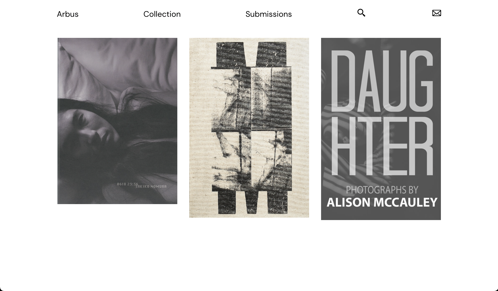
 
 

## About:
Arbus is an App for Photobook Collectors. It's a user submitted resource where anyone can access detailed information on Photobooks.\
This project was completed as final project for Concordia's Web Development Bootcamp.\
I built this project using React, Node.js, Express, MongoDB and Styled-Components.

View a demonstration here: https://www.youtube.com/watch?v=HQO0AGLM_bk
 
 

## Instructions:
1. Fork the repository
2. Clone the repository
3. cd server
4. yarn install
5. yarn start
6. In a new terminal cd client
7. yarn install
8. yarn start
9. In your broswer go to http://localhost:3000 to view project
 
 

## User Features:
### Individual Book details page with pop up images:
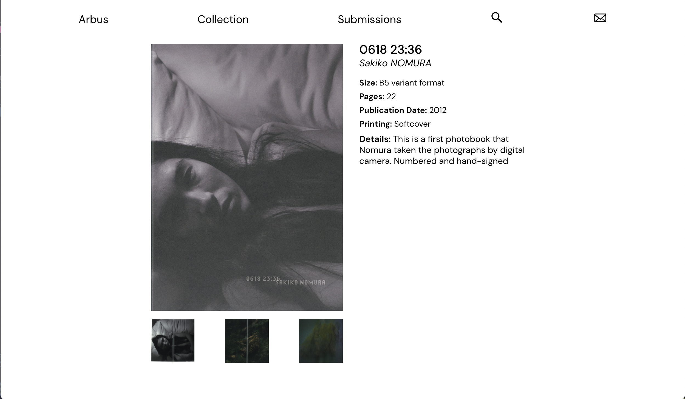
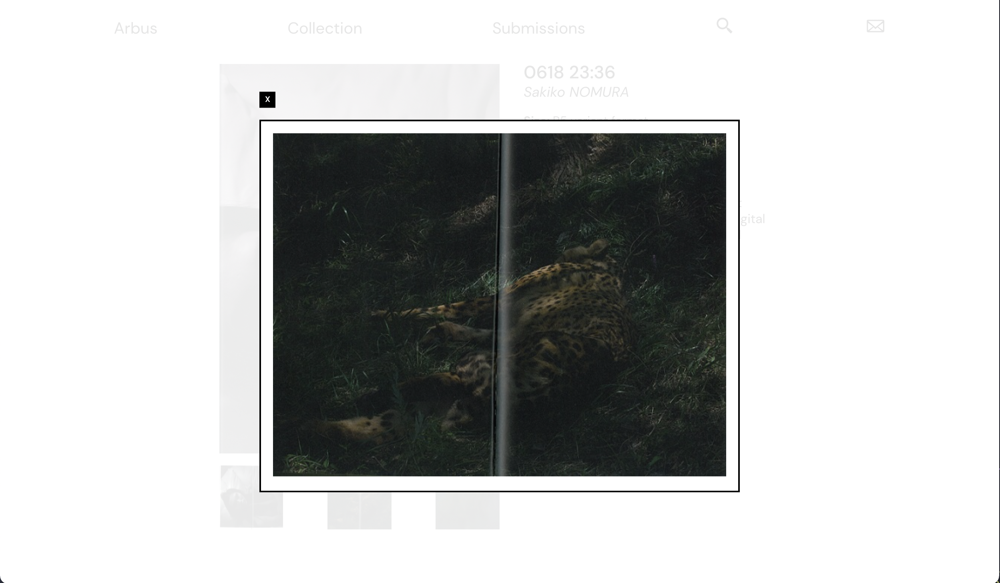
 
 

### Search:
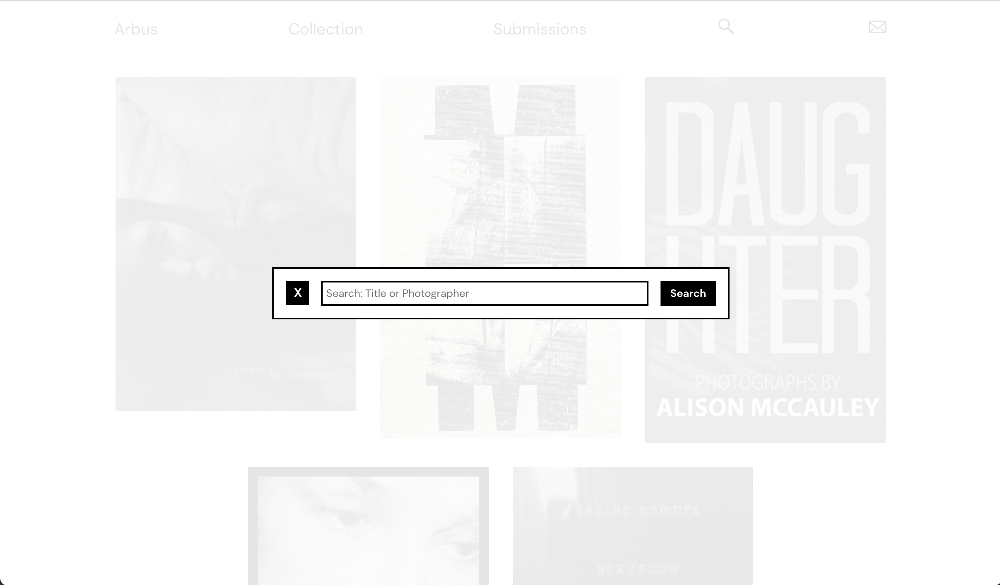
 
 

### User submissions:
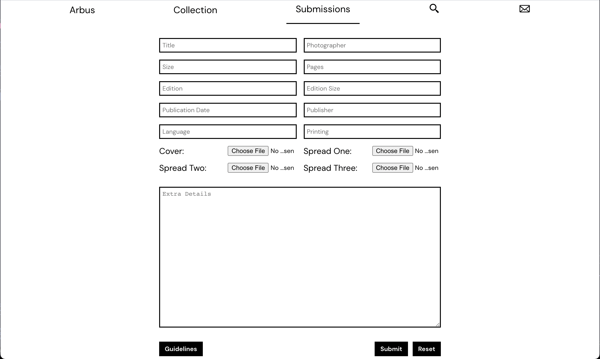
 
 

## Admin features:
### View all submissions:
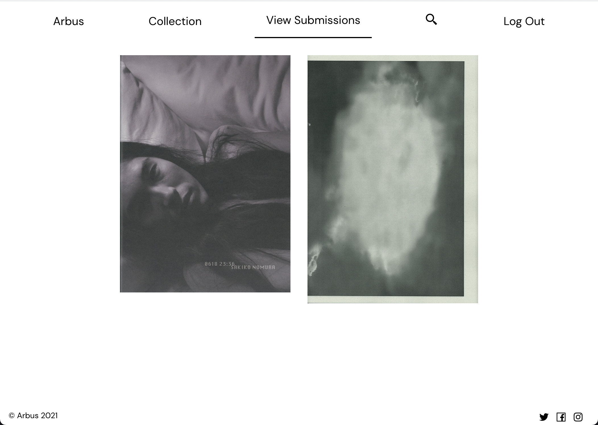
From the view all submissions page the Admin can choose to reject or view the submission details.
 
 

### View submission details:
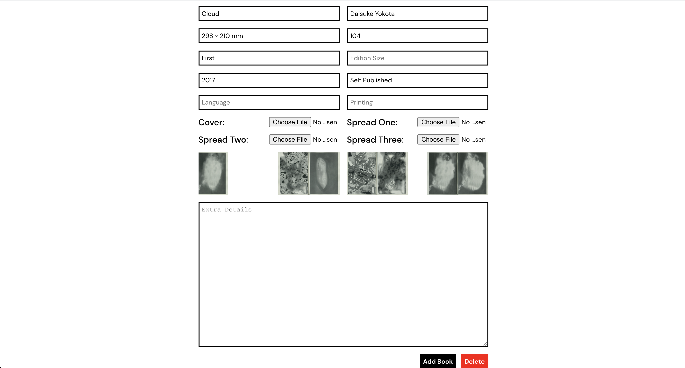
Approve, edit or reject submission.
 
 

### Edit all books in the collection:
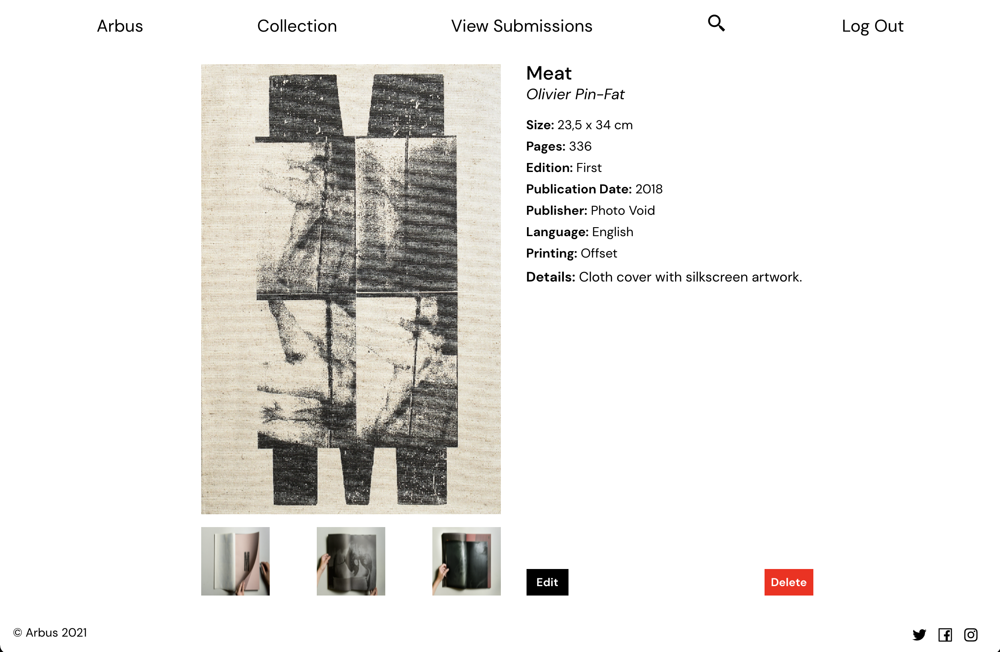
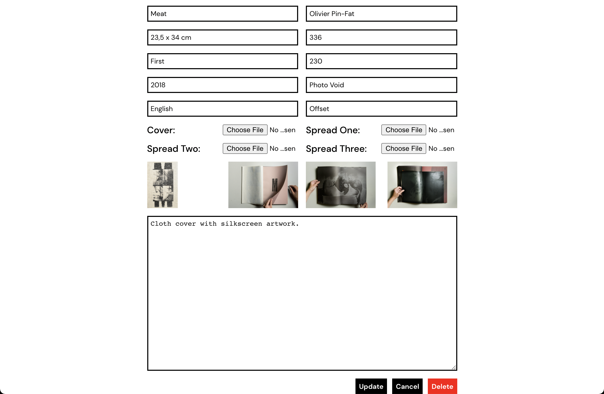
Admin can edit or remove any book in the collection after it was been submitted.
 
 

### Add books to collection:
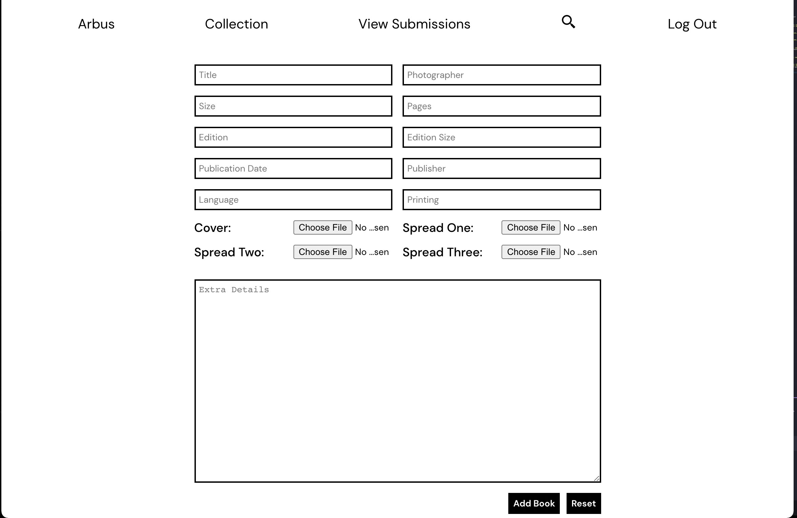
 
 

### Mobile responsive:
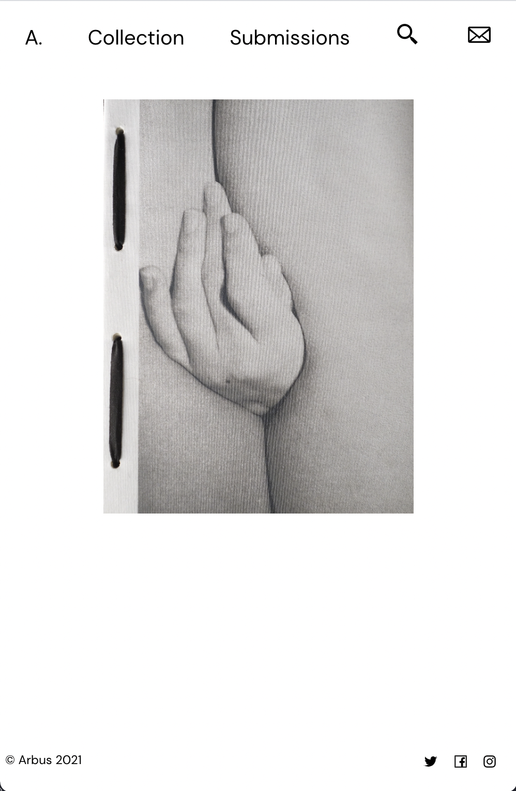
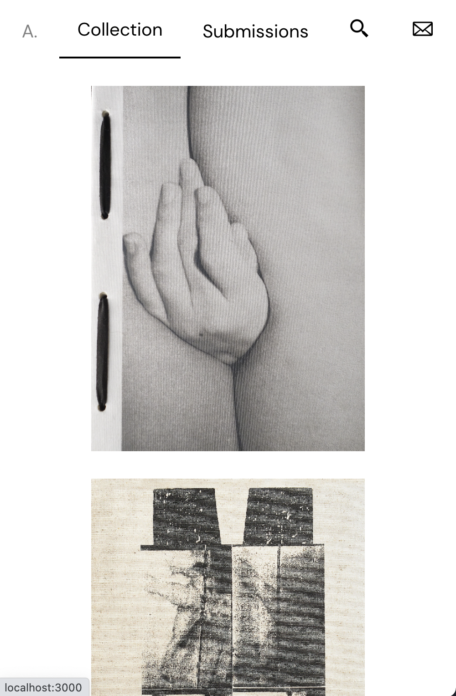
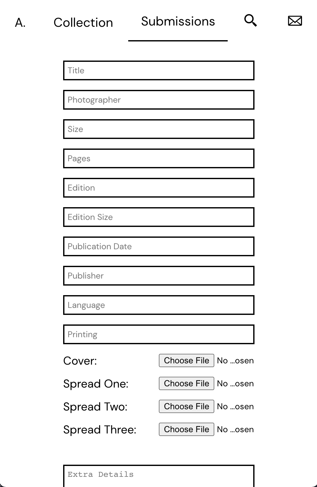
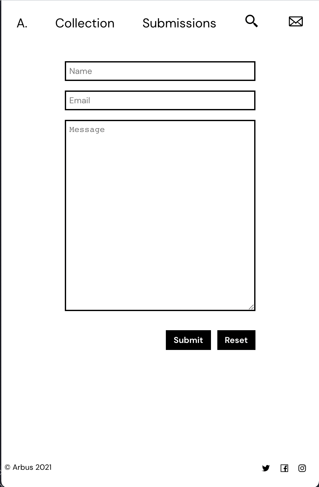

## Frontend dependencies:
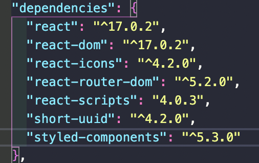
 
 

## Backend dependencies:
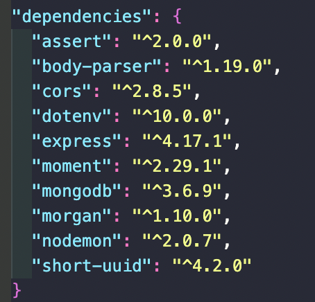

